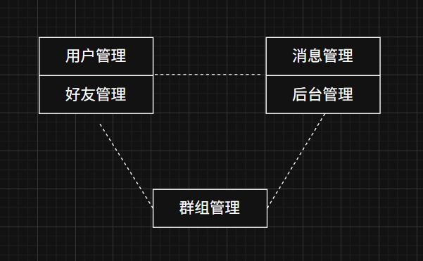

# 手写RPC框架

## 一、RPC通信原理

RPC又叫远程过程调用，它的核心原理是在分布式系统中的函数调用中，隐藏网络通信的细节，使得开发者可以像调用本地函数一样调用远程服务。

我们先从传统的单机和集群聊天服务器讲起

1. 单机服务器

.png)

2. 集群服务器

为了弥补单机服务器的缺陷，自然能想到集群服务器，一个服务器不行，那我们就多弄几个


每一个服务器都有一套独立的管理系统，这种架构的优点很明显
- 并发量提升
- 每台服务器都是一个独立的服务，如果中间某台挂掉也不会影响业务
- 部署简单，一台机器与多台机器部署方式相同，如果临时需要增大并发量可以直接部署

但是缺点也比较明显：
- ，比如只修改一个小的地方，但是全部代码都需要重新编译一遍，因为模块未分开部署。
- 系统中有些模块属于CPU密集型，有些属于IO密集型，资源需求不一致，但是各个模块捆包在一起浪费资源

3. 分布式系统



把各个模块分开，独立成单独的服务，每个模块独立部署在不同机器上，所有服务共同构成一个系统，给客户端提供服务

分布式系统灵活的点在于

- 可以根据模块的特点配备特定的硬件设备，比如CPU密集型或者IO密集型
- 对应需求量高的任务可以做成服务集群，提高并发量

在分布式系统中，比如server1调用server2的方法，内部是通过远程调用，但是通过RPC框架将这些远程的调用细节封装起来，变得像本地调用一样方便。

4. rpc通信原理

.png)
图中红框内的部分就是rpc框架的作用，将通信细节封装起来

**黄色部分**：设计rpc方法参数的打包和解析，也就是数据的序列化和反序列化，使用Protobuf

**绿色部分**：网络部分，包括寻找rpc服务主机，发起rpc调用请求和响应rpc调用结果，使用muduo网络库和zookeeper服务配置中心（专门做服务发现）

## 二、protobuf

### 2.1 如何使用

对于我们本地文件中的数据，比如 ：
```cpp
//单一类型
int number;

//重复数据类型
int numbers[100];

// 复合数据类型
struct Person
{
    int id;
    string name;
    string sex;	
    int age;
};
```
对应的protobuf文件为：test.proto
```cpp
//版本号
syntax = "proto3";

// 定义单一类型的消息
message SingleType {
    int32 number = 1; // 单一类型的整数
}

// 定义重复数据类型的消息
message RepeatedType {
    repeated int32 numbers = 1; // 重复数据类型的整数数组
}

// 定义复合数据类型的消息
message Person {
    int32 id = 1;       // ID
    string name = 2;    // 名称
    string sex = 3;     // 性别
    int32 age = 4;      // 年龄
}
```
 
在protobuf文件中，所有的数据类型都用message包装,在使用protoc转换后，所有的message在c++中都是一个类，而message中的成员就是类的成员变量
```cpp
message 名字	
{
    // 类中的成员, 格式
    数据类型 成员名字 = 1;
    数据类型 成员名字 = 2;
    数据类型 成员名字 = 3;
	   ......     
	   ......
}
```
- message后面的名字就是生成的类的名字
- 等号后面的编号要从1开始，每个成员都有一个唯一的编号，不能重复，一般连续编号即可

.proto文件编辑好之后使用protoc工具将其转换为.pb.cc和pb.h文件
```shell
$ protoc -I path .proto文件 --cpp_out=输出路径(存储生成的c++文件)
```
在我们这个例子中，使用：
```shell
$ protoc ./Person.proto --cpp_out=.
```
文件会生成到当前目录下，这两个文件就和cpp的头文件和源文件一样，里面有我们定义以message为名字的类，同时生成set和get接口来给外界访问成员变量

### 2.2 语法

Protobuf 数据类型与 C++ 数据类型对照表

| Protobuf 数据类型 | C++ 数据类型              | 描述                                                         |
|-------------------|---------------------------|-------------------------------------------------------------|
| `double`          | `double`                 | 双精度浮点数                                                |
| `float`           | `float`                  | 单精度浮点数                                                |
| `int32`           | `int32_t` 或 `int`       | 32 位有符号整数                                             |
| `int64`           | `int64_t` 或 `long long` | 64 位有符号整数                                             |
| `uint32`          | `uint32_t` 或 `unsigned int` | 32 位无符号整数                                         |
| `uint64`          | `uint64_t` 或 `unsigned long long` | 64 位无符号整数                                     |
| `sint32`          | `int32_t` 或 `int`       | 使用 ZigZag 编码的 32 位有符号整数                          |
| `sint64`          | `int64_t` 或 `long long` | 使用 ZigZag 编码的 64 位有符号整数                          |
| `fixed32`         | `uint32_t`               | 固定大小的 32 位无符号整数                                  |
| `fixed64`         | `uint64_t`               | 固定大小的 64 位无符号整数                                  |
| `sfixed32`        | `int32_t`                | 固定大小的 32 位有符号整数                                  |
| `sfixed64`        | `int64_t`                | 固定大小的 64 位有符号整数                                  |
| `bool`            | `bool`                   | 布尔值（`true` 或 `false`）                                 |
| `string`          | `std::string`            | 字符串（UTF-8 编码）                                         |
| `bytes`           | `std::string` 或 `std::vector<uint8_t>` | 字节序列，可用于存储二进制数据                         |

#### **Map 类型**

| Protobuf 数据类型      | C++ 数据类型                       | 描述                              |
|------------------------|------------------------------------|-----------------------------------|
| `map<KeyType,ValueType>` | `std::map<KeyType, ValueType>`    | 键值对映射                       |


#### **Repeated 类型**：数组，容器等重复数据类型

**示例**：
```protobuf
repeated int32 numbers = 1;
```
对应的 C++ 类型：
```cpp
std::vector<int32_t> numbers;
```

#### **枚举类型**

**示例**：
```protobuf
enum Color {
  RED = 0;
  GREEN = 1;
  BLUE = 2;
}
```
对应的 C++ 类型：
```cpp
enum Color {
  RED = 0,
  GREEN = 1,
  BLUE = 2
};
```

### 2.3 proto文件的导入
在 Protocol Buffers 中，可以使用import语句在当前.ptoto中导入其它的.proto文件。这样就可以在一个.proto文件中引用并使用其它文件中定义的消息类型和枚举类型

语法如下：

```cpp
import "要使用的proto文件的名字";
```
比如刚刚提到的test.proto，我要在下面这个文件中使用其中的数据
```cpp
```protobuf
// 版本号
syntax = "proto3";

// 引入 test.proto 文件
import "test.proto";

// 使用 test.proto 中定义的消息类型
message Student {
    Person person = 1; // 使用 Person 类型
    int32 grade = 2;   // 学生成绩
}

message SingleWrapper {
    SingleType single = 1; // 使用 SingleType 类型
}

message RepeatedWrapper {
    RepeatedType repeated = 1; // 使用 RepeatedType 类型
}
```
- RepeatedType等同于repeated，前者用于自定义消息类型
- 导入的文件将会在编译时与当前文件一起被编译。
- 导入的文件也可以继续导入其他文件，形成一个文件依赖的层次结构

### 2.4 package
在 Protobuf 中，可以使用package关键字来定义一个消息所属的包（package）。类似于命名空间

在一个.proto文件的顶层使用package关键字来定义包：
```cpp
syntax = "proto3";
package mypackage;
message MyMessage 
{
  // ...
}
```
代表这个文件中所有的数据类型都属于mypackage命名空间下

### 2.5 序列化和反序列化
1. 序列化
```cpp
// 头文件目录: google\protobuf\message_lite.h
// --- 将序列化的数据 数据保存到内存中
// 将类对象中的数据序列化为字符串, c++ 风格的字符串, 参数是一个传出参数
bool SerializeToString(std::string* output) const;
// 将类对象中的数据序列化为字符串, c 风格的字符串, 参数 data 是一个传出参数
bool SerializeToArray(void* data, int size) const;

// ------ 写磁盘文件, 只需要调用这个函数, 数据自动被写入到磁盘文件中
// -- 需要提供流对象/文件描述符关联一个磁盘文件
// 将数据序列化写入到磁盘文件中, c++ 风格
// ostream 子类 ofstream -> 写文件
bool SerializeToOstream(std::ostream* output) const;
// 将数据序列化写入到磁盘文件中, c 风格
bool SerializeToFileDescriptor(int file_descriptor) const;
```
2. 反序列化
```cpp
// 头文件目录: google\protobuf\message_lite.h
bool ParseFromString(const std::string& data) ;
bool ParseFromArray(const void* data, int size);
// istream -> 子类 ifstream -> 读操作
// w->写 o: ofstream , r->读 i: ifstream
bool ParseFromIstream(std::istream* input);
bool ParseFromFileDescriptor(int file_descriptor);
```

### 2.6 在rpc通信中的序列化和反序列化

## 三、从使用角度理解框架的功能

